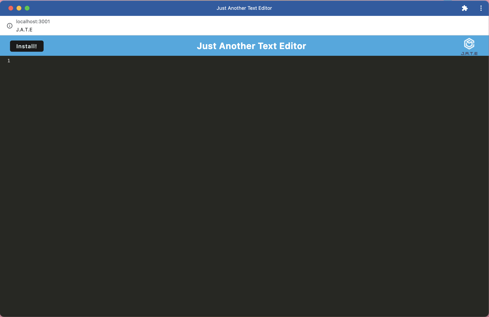
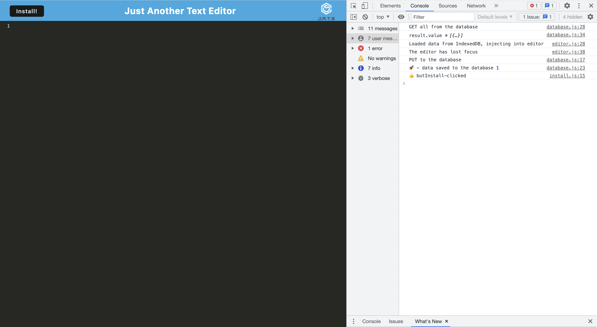
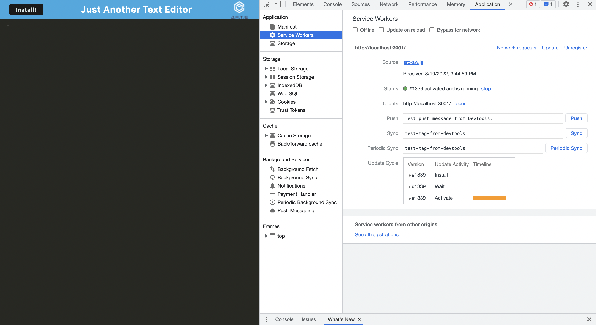
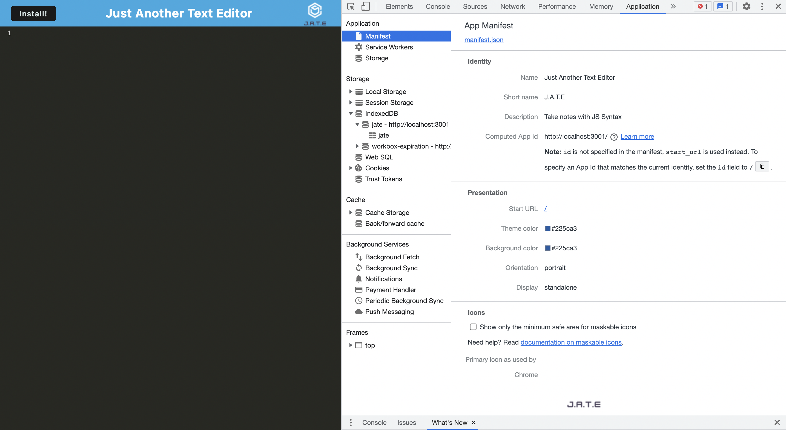
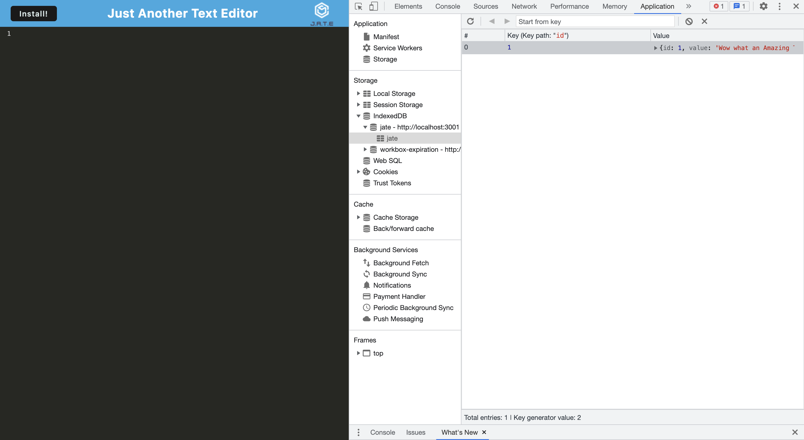

# PWA (Progressive Web Application) Text Editor
[](https://opensource.org/licenses/)
#### **Name:** Honore Nelson 
#### **Deployed Link:** https://jatetexteditor01.herokuapp.com/
#### **Github Repo:** https://github.com/matisses-goldfish/textEditor
---
    
##  Table of Contents:
* [Description](#description)
* [Walkthrough](#walkthrough)
* [Technologies Used](#technologies-used)
* [Application](#application)
* [Usage Information](#usage)
* [Contribution Guidelines](#contribution-guidelines)
* [Authors](#authors)
* [License](#license)
* [Question](#questions)


## Description:
---

This application is text editor that runs in both the browser and as a PWA (progressive web application). The app will be a single-page application that meets the PWA criteria. Additionally, it features a number of data persistence techniques that serve as redundancy in case one of the options is not supported by the browser. The application also functions offline.

To build this text editor, I started with an existing application and implement methods for getting and storing data to an IndexedDB database. I used a package called `idb`, which is a lightweight wrapper around the IndexedDB API. It features a number of methods that are useful for storing and retrieving data, and is used by companies like Google and Mozilla.


## Walkthrough:
---
[](https://www.youtube.com/watch?v=nezm3vbq6HQ)

## Aceptance Criteria:
---
```md
GIVEN a text editor web application
WHEN I open my application in my editor
THEN I should see a client server folder structure
WHEN I run `npm run start` from the root directory
THEN I find that my application should start up the backend and serve the client
WHEN I run the text editor application from my terminal
THEN I find that my JavaScript files have been bundled using webpack
WHEN I run my webpack plugins
THEN I find that I have a generated HTML file, service worker, and a manifest file
WHEN I use next-gen JavaScript in my application
THEN I find that the text editor still functions in the browser without errors
WHEN I open the text editor
THEN I find that IndexedDB has immediately created a database storage
WHEN I enter content and subsequently click off of the DOM window
THEN I find that the content in the text editor has been saved with IndexedDB
WHEN I reopen the text editor after closing it
THEN I find that the content in the text editor has been retrieved from our IndexedDB
WHEN I click on the Install button
THEN I download my web application as an icon on my desktop
WHEN I load my web application
THEN I should have a registered service worker using workbox
WHEN I register a service worker
THEN I should have my static assets pre cached upon loading along with subsequent pages and static assets
WHEN I deploy to Heroku
THEN I should have proper build scripts for a webpack application
```

## Technologies Used:
---
- **babel**
- **css-loader**
- **html-webpack-plugin**
- **webpack**
- **styleloader**
- **core-js** 
- **idb**
- **regenerator-runtime**

## Application:
---

### Console Log:

### Service Worker:

### Manifest:

### Storage:


## Usage:
---
Begin the application by opening the link provided (), write your javascript, and watch the magic happen! Want to download it offline? simply click the install button to download it to your computer!
     
    
## Contribution Guidelines:
---
Contribute to this project using the Github work flow model!

    
## Authors
---
* **Honore Nelson** - *Initial work* - [Text Editor]( https://github.com/matisses-goldfish/textEditor)
    
## License
---

This project is licensed under the MIT License - see the [LICENSE.md](LICENSE.md) file for details
<br></br>

## Question
---
Any additional question? Reach out via Github!
* Honore Nelson: https://github.com/matisses-goldfish
